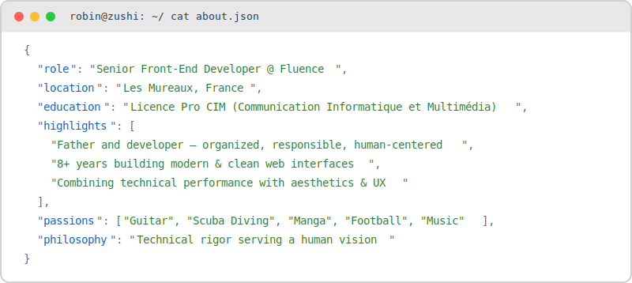
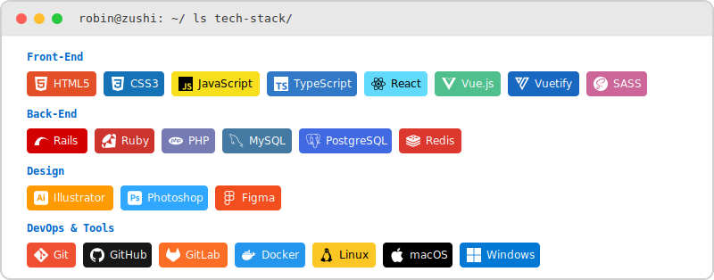
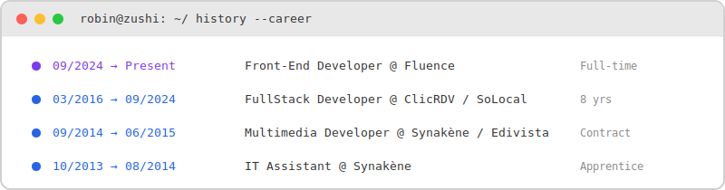

<!-- HEADER WAVE -->
<picture>
  <source media="(prefers-color-scheme: dark)" srcset="https://capsule-render.vercel.app/api?type=waving&amp;color=0:1A1A2E%2C100:0F3460&amp;height=120&amp;section=header" width="100%"/>
  <source media="(prefers-color-scheme: light)" srcset="https://capsule-render.vercel.app/api?type=waving&amp;color=0:1565C0%2C100:0D47A1&amp;height=120&amp;section=header" width="100%"/>
  
</picture>

<!-- LOGO + NAME -->
<a href="https://books.zushi.me">
  <picture>
    <source media="(prefers-color-scheme: dark)" srcset="https://books.zushi.me/images/zushi-logo-light.svg"/>
    <source media="(prefers-color-scheme: light)" srcset="https://books.zushi.me/images/zushi-logo-dark.svg"/>
    
  </picture>
</a>
 

  

  

&nbsp;

&nbsp;

 
 

<!-- ABOUT -->
<picture>
  <source media="(prefers-color-scheme: dark)" srcset="./assets/about.svg" width="100%"/>
  <source media="(prefers-color-scheme: light)" srcset="./assets/about-light.svg" width="100%"/>
  
</picture>

 
 

<!-- STACK -->
<picture>
  <source media="(prefers-color-scheme: dark)" srcset="./assets/stack.svg" width="100%"/>
  <source media="(prefers-color-scheme: light)" srcset="./assets/stack-light.svg" width="100%"/>
  
</picture>

 
 

<!-- CAREER -->
<picture>
  <source media="(prefers-color-scheme: dark)" srcset="./assets/career.svg" width="100%"/>
  <source media="(prefers-color-scheme: light)" srcset="./assets/career-light.svg" width="100%"/>
  
</picture>

 
 
 

*"Technical rigor serving a human vision"*

<!-- FOOTER WAVE -->
<picture>
  <source media="(prefers-color-scheme: dark)" srcset="https://capsule-render.vercel.app/api?type=waving&amp;color=0:0F3460%2C100:1A1A2E&amp;height=120&amp;section=footer" width="100%"/>
  <source media="(prefers-color-scheme: light)" srcset="https://capsule-render.vercel.app/api?type=waving&amp;color=0:1565C0%2C100:0D47A1&amp;height=120&amp;section=footer" width="100%"/>
  
</picture>
